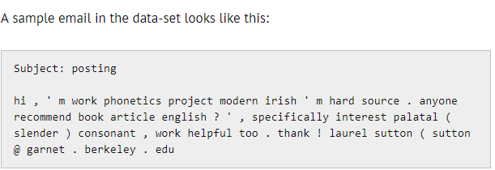

# build_a_spam_filter

* There are 922 e-mails divided equally between spam and non-spam(ham)
* The first line of every email contains the subject and the third line contains the body as shown:

## Perform text analysis only on the body to detect spam mails
### Steps:
1. Read the body of all the emails.
2. Once you read, the content of all the mails can be collected in a python list.
3. Create a pandas dataframe from that list and add the class label column [spam(1) or ham(0)]
4. The shape of the pandas dataframe must be (922 x 2) - 922 rows and 2 columns
5. Perform the standard preprocessing steps on the contents of the mail (stopword removal, lower casing, etc.)
6. After that create vectors using Binary BOW, count BOW and TFIDF.
7. Use BernoulliNB with Binary BOW and MultinomialNB with Count BOW and TFIDF
8. Evaluate all the three methods using Accuracy, Confusion Matrix and F-1 Score.
9. Compare the results of the three methods
